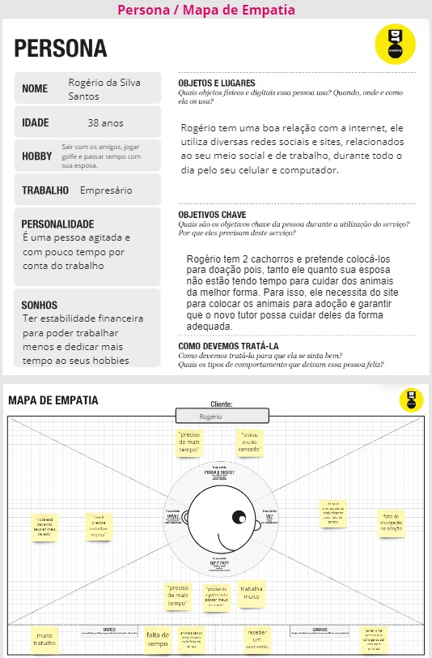
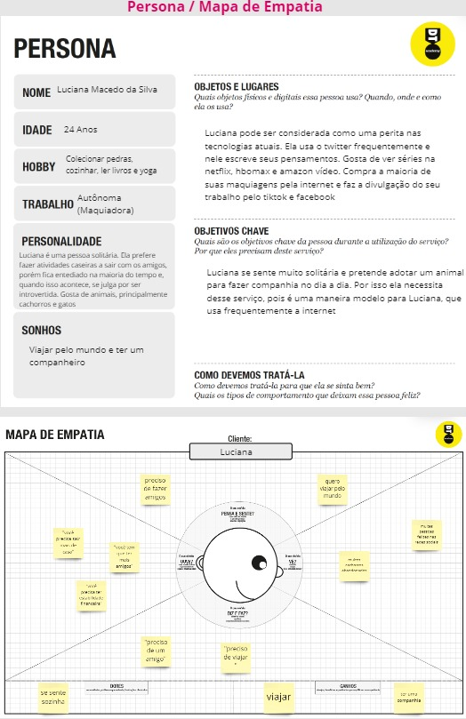
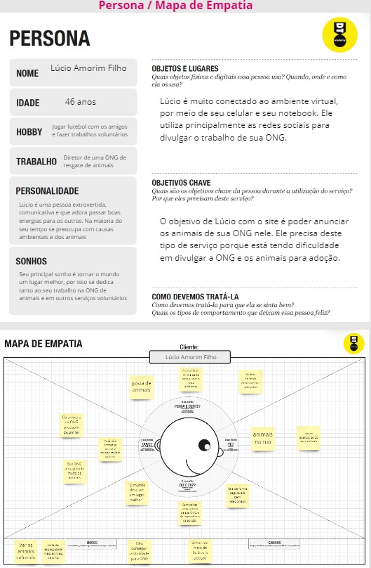
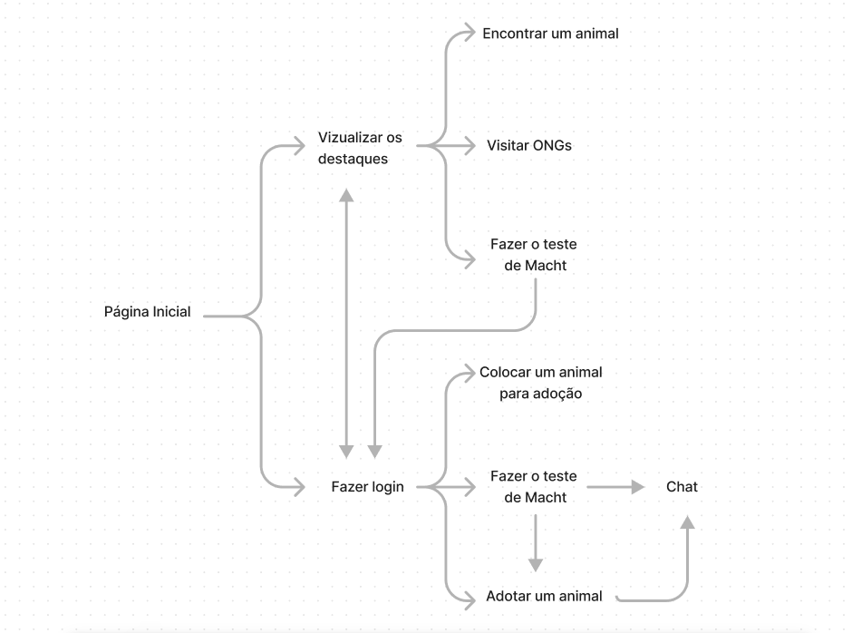
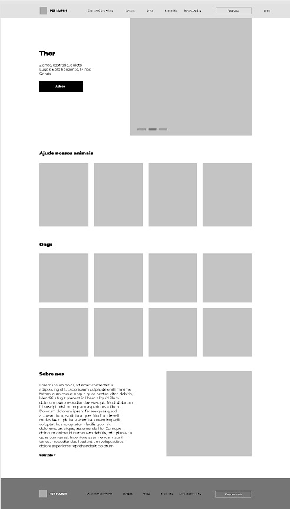

# Informações do Projeto
`TÍTULO DO PROJETO`  

Pet Match

`CURSO` 

Ciências da computação - TIAW - 1° período 

## Participantes

Os membros do grupo são:
- Arthur Vinícius Reis Rodrigues
- Barbara Maria Sampaio Portes
- Gabriel Vitorio Goncalves
- Leonardo Yukio Macedo Kamei
- Samuel Parreiras de Souza
- Theo Xavier Lopes

# Estrutura do Documento

- [Informações do Projeto](#informações-do-projeto)
  - [Participantes](#participantes)
- [Estrutura do Documento](#estrutura-do-documento)
- [Introdução](#introdução)
  - [Problema](#problema)
  - [Objetivos](#objetivos)
  - [Justificativa](#justificativa)
  - [Público-Alvo](#público-alvo)
- [Especificações do Projeto](#especificações-do-projeto)
  - [Personas e Mapas de Empatia](#personas-e-mapas-de-empatia)
  - [Histórias de Usuários](#histórias-de-usuários)
  - [Requisitos](#requisitos)
    - [Requisitos Funcionais](#requisitos-funcionais)
    - [Requisitos não Funcionais](#requisitos-não-funcionais)
  - [Restrições](#restrições)
- [Projeto de Interface](#projeto-de-interface)
  - [User Flow](#user-flow)
  - [Wireframes](#wireframes)
- [Metodologia](#metodologia)
  - [Divisão de Papéis](#divisão-de-papéis)
  - [Ferramentas](#ferramentas)
  - [Controle de Versão](#controle-de-versão)
- [**############## SPRINT 1 ACABA AQUI #############**](#-sprint-1-acaba-aqui-)
- [Projeto da Solução](#projeto-da-solução)
  - [Tecnologias Utilizadas](#tecnologias-utilizadas)
  - [Arquitetura da solução](#arquitetura-da-solução)
- [Avaliação da Aplicação](#avaliação-da-aplicação)
  - [Plano de Testes](#plano-de-testes)
  - [Ferramentas de Testes (Opcional)](#ferramentas-de-testes-opcional)
  - [Registros de Testes](#registros-de-testes)
- [Referências](#referências)

# Introdução

## Problema

A dificuldade na doação de animais é um problema que afeta mais as pessoas que estão envolvidas
nesse meio, como pessoas envolvidas com ONG's de resgate e adoção de animais e pessoas
interessadas em adotar um animal. O problema maior é a falta de interação e comunicação entre essas
pessoas e as ONG's, nosso objetivo é fazer uma ponte entre essas pessoas.

## Objetivos, Justificativa, Público-Alvo e Especificações do Projeto

Nosso problema é muito auto explicativo, “Dificuldade na Adoção de Animais”, se você já quis adotar um animal você muito provavelmente sabe das dificuldade que existem, como:
- Achar algum lugar fácil para isso;
- Saber um pouco mais sobre o animal antes da adoção, como histórico de saúde e características comportamentais do animal;
- Ter mais opções de pets.

E se você já tentou colocar algum animal para adoção sabe como é uma tarefa difícil,
- Ter um lugar para anunciar e divulgar a adoção;
- Conscientizar as pessoas sobre a responsabilidade;
- Saber se a pessoa que está adotando é confiável;
- Competir com a venda de animais.

Nosso principal objetivo é fazer uma ponte entre as pessoas que tem um animal para adoção com as pessoas que querem adotar um pet, assim como conscientizar as pessoas sobre a adoção responsável de animais. Nosso público alvo são as ONGs de resgate e adoção de animais e pessoas interessadas em doar ou adotar animais domésticos.

## Personas e Mapas de Empatia

> **Exemplo de Persona**
> 
> 
> 
> 
> 
> 

## Histórias de Usuários

Com base na análise das personas forma identificadas as seguintes histórias de usuários:

|EU COMO... `PERSONA`| QUERO/PRECISO ... `FUNCIONALIDADE` |PARA ... `MOTIVO/VALOR`                 |
|--------------------|------------------------------------|----------------------------------------|
|Pessoa interressada em adotar|Escolher um animal para adotar que combine com minha personalidade e necessidades|Para que o pet possa ser meu e eu possa cuidar dele|
|Pessoa interessada em colocar animal para adoção|Anunciar meu animal para ser adotado por algúem de confiança|Para que o pet possa ter um lar melhor|
|ONG|Colocar meus animais para adoção|Para impulsionar as adoções de animais que não são tão altas somente com a inflência da ONG|

## Requisitos

As tabelas que se seguem apresentam os requisitos funcionais e não funcionais que detalham o escopo do projeto.

### Requisitos Funcionais

|ID    | Descrição do Requisito  | Prioridade |
|------|-----------------------------------------|----|
|RF-001| Permitir que o usuário cadastre animais para doação | ALTA | 
|RF-002| Permitir que o usuário escolha um animal para adotar   | ALTA |
|RF-003| Permitir que o usuário converse por chat com o atual dono do animal/ONG | MÉDIA |
|RF-004| Permitir que o usuário apadrinhe um animal | MÉDIA |
|RF-005| Permitir que o usuário faça um teste de perfil e dê "match" com outro animal| MÉDIA |
|RF-006| Anúncios no site para monetização | BAIXA |

### Requisitos não Funcionais

|ID     | Descrição do Requisito  |Prioridade |
|-------|-------------------------|----|
|RNF-001| O sistema deve ser responsivo para rodar em um dispositivos móvel | ALTA | 
|RNF-002| O site deve seguir as cores da logo | ALTA |
|RNF-003| Site deve ser desenvolvido com estrutura que facilite a manutenção |  MÉDIO | 
|RNF-004| A navegação do site deve ser otimizada para reduzir a necessidade de cliques e facilitar o acesso para quem não tem muita intimidade com sites da internet | MÉDIA |
|RNF-005| Seções ou botões devem se destacar com o movimento do cursor (hover) | BAIXA |

## Restrições

O projeto está restrito pelos itens apresentados na tabela a seguir.

|ID| Restrição                                             |
|--|-------------------------------------------------------|
|01| O projeto deverá ser entregue até o final do semestre |
|02| Não pode ser desenvolvido um módulo de backend        |
|03| Utilização de HTML5 no desenvolvimento do site        |

# Projeto de Interface

## User Flow

> 

## Wireframes

Wireframe da página feito no Figma.

> 

# Metodologia

## Divisão de Papéis

A divisão de papéis foi feita de acordo com a metodologia scrum e usando o Kanban.

## Ferramentas

......  COLOQUE AQUI O SEU TEXTO - SIGA O EXEMPLO DA TABELA ABAIXO  ......

| Ambiente  | Plataforma              |Link de Acesso |
|-----------|-------------------------|---------------|
|Processo de Design Thinkgin  | Miro |  https://miro.com/XXXXXXX | 
|Repositório de código | GitHub | https://github.com/XXXXXXX | 
|Hospedagem do site | Heroku |  https://XXXXXXX.herokuapp.com | 
|Protótipo Interativo | Figma | https://figma.com/XXXXXXX | 

As ferramentas empregadas no projeto são:

-VSCode (Editor de Código).

-HTML5, CSS e JavaScript (Tecnologias).

-WhatsApp e Teams (Ferramentas de comunicação).

-Figma (Ferramenta de diagramação).

O editor de código foi escolhido porque ele possui uma integração com o sistema de versão. As ferramentas de comunicação utilizadas possuem integração semelhante e por isso foram selecionadas. Por fim, para criar diagramas utilizamos essa ferramenta por melhor captar as necessidades da nossa solução.

## Controle de Versão

A ferramenta de controle de versão adotada no projeto foi o Git, sendo que o Github foi utilizado para hospedagem do repositório.

O projeto segue a seguinte convenção para o nome de branchs:

- main: versão estável já testada do software

Quanto à gerência de issues, o projeto adota a seguinte convenção para etiquetas:

documentation: melhorias ou acréscimos à documentação
bug: uma funcionalidade encontra-se com problemas
enhancement: uma funcionalidade precisa ser melhorada
feature: uma nova funcionalidade precisa ser introduzida

# **############## SPRINT 1 ACABA AQUI #############**

# Projeto da Solução

......  COLOQUE AQUI O SEU TEXTO ......

## Tecnologias Utilizadas

......  COLOQUE AQUI O SEU TEXTO ......

> Descreva aqui qual(is) tecnologias você vai usar para resolver o seu
> problema, ou seja, implementar a sua solução. Liste todas as
> tecnologias envolvidas, linguagens a serem utilizadas, serviços web,
> frameworks, bibliotecas, IDEs de desenvolvimento, e ferramentas.
> Apresente também uma figura explicando como as tecnologias estão
> relacionadas ou como uma interação do usuário com o sistema vai ser
> conduzida, por onde ela passa até retornar uma resposta ao usuário.
> 
> Inclua os diagramas de User Flow, esboços criados pelo grupo
> (stoyboards), além dos protótipos de telas (wireframes). Descreva cada
> item textualmente comentando e complementando o que está apresentado
> nas imagens.

## Arquitetura da solução

......  COLOQUE AQUI O SEU TEXTO E O DIAGRAMA DE ARQUITETURA .......

> Inclua um diagrama da solução e descreva os módulos e as tecnologias
> que fazem parte da solução. Discorra sobre o diagrama.
> 
> **Exemplo do diagrama de Arquitetura**:
> 
> 

# Avaliação da Aplicação

......  COLOQUE AQUI O SEU TEXTO ......

> Apresente os cenários de testes utilizados na realização dos testes da
> sua aplicação. Escolha cenários de testes que demonstrem os requisitos
> sendo satisfeitos.

## Plano de Testes

......  COLOQUE AQUI O SEU TEXTO ......

> Enumere quais cenários de testes foram selecionados para teste. Neste
> tópico o grupo deve detalhar quais funcionalidades avaliadas, o grupo
> de usuários que foi escolhido para participar do teste e as
> ferramentas utilizadas.
> 
> **Links Úteis**:
> - [IBM - Criação e Geração de Planos de Teste](https://www.ibm.com/developerworks/br/local/rational/criacao_geracao_planos_testes_software/index.html)
> - [Práticas e Técnicas de Testes Ágeis](http://assiste.serpro.gov.br/serproagil/Apresenta/slides.pdf)
> -  [Teste de Software: Conceitos e tipos de testes](https://blog.onedaytesting.com.br/teste-de-software/)

## Ferramentas de Testes (Opcional)

......  COLOQUE AQUI O SEU TEXTO ......

> Comente sobre as ferramentas de testes utilizadas.
> 
> **Links Úteis**:
> - [Ferramentas de Test para Java Script](https://geekflare.com/javascript-unit-testing/)
> - [UX Tools](https://uxdesign.cc/ux-user-research-and-user-testing-tools-2d339d379dc7)

## Registros de Testes

......  COLOQUE AQUI O SEU TEXTO ......

> Discorra sobre os resultados do teste. Ressaltando pontos fortes e
> fracos identificados na solução. Comente como o grupo pretende atacar
> esses pontos nas próximas iterações. Apresente as falhas detectadas e
> as melhorias geradas a partir dos resultados obtidos nos testes.

# Referências

......  COLOQUE AQUI O SEU TEXTO ......

> Inclua todas as referências (livros, artigos, sites, etc) utilizados
> no desenvolvimento do trabalho.
> 
> **Links Úteis**:
> - [Formato ABNT](https://www.normastecnicas.com/abnt/trabalhos-academicos/referencias/)
> - [Referências Bibliográficas da ABNT](https://comunidade.rockcontent.com/referencia-bibliografica-abnt/)
